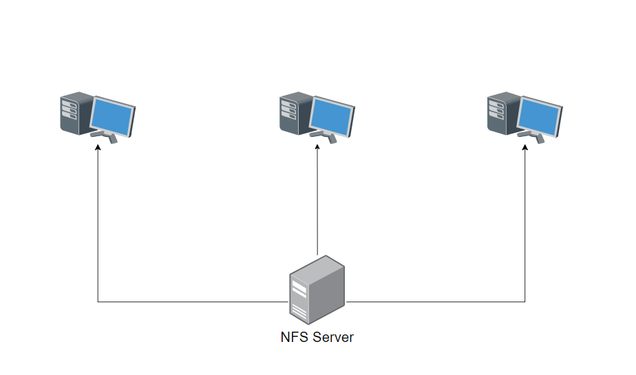

# A bash script for configuring a Linux NFS server

An NFS (Network File System) server is a system that shares files and directories with other computers on a network using the NFS protocol. NFS allows clients to access files over a network as if they were located on the client's local filesystem.

NFS is commonly used in environments where multiple computers need to access shared files or data, such as in office networks, academic institutions, or data centers. It provides a convenient way to share data between computers running different operating systems, as long as they support the NFS protocol.

## Usage 

===
SERVER-SIDE
===

mkdir /mnt/nfs_resources 

apt install nfs-server -y

/etc/exports

++++/mnt/nfs_resources 10.1.1.0/24(rw)

exportfs -ra

chown -R ...

====
CLIENT-SIDE
====

mkdir /mnt/network_shares

apt install nfs-common -y

mount <ip of server>:/mnt/nfs_resources /mnt/network_shares

ls /mnt/network_shares

chown -R ...